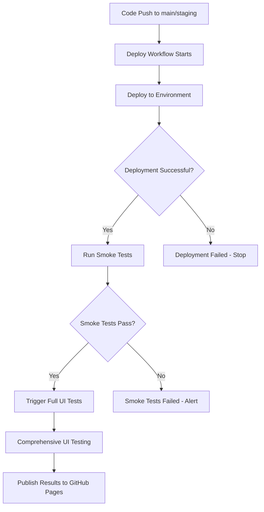

# Deployment Testing Workflow

This document explains how our automated testing works with deployments.

## 🔄 Workflow Overview



## 🚀 Deployment Triggers

### Automatic Triggers
- **Push to `main`** → Deploy to Production → Test Production
- **Push to `staging`** → Deploy to Staging → Test Staging

### Manual Triggers
- **Workflow Dispatch** → Deploy to chosen environment → Test that environment

## 🧪 Testing Phases

### Phase 1: Smoke Tests (Fast - ~2 minutes)
**Purpose:** Quick verification that critical functionality works after deployment

**Tests Include:**
- Login page loads correctly
- Authentication redirects work
- Basic chart loading functionality
- Core indicator toggle

**Benefits:**
- ⚡ Fast feedback (2-3 minutes)
- 🚨 Early failure detection
- 🎯 Critical path verification

### Phase 2: Full UI Test Suite (~5-8 minutes)
**Purpose:** Comprehensive testing of all features

**Tests Include:**
- All authentication scenarios
- Complete dashboard functionality
- All chart interactions and modes
- Technical indicators and moving averages
- Multiple feature combinations

**Benefits:**
- 🔍 Comprehensive coverage
- 📊 Detailed reporting
- 🏆 Full confidence in deployment

## 🌐 Environment Testing

### Production Deployment
```
main branch → https://www.akinatorassets.com
├── Smoke Tests (critical path)
└── Full UI Tests (comprehensive)
```

### Staging Deployment
```
staging branch → https://staging.akinatorassets.com
├── Smoke Tests (critical path)
└── Full UI Tests (comprehensive)
```

## 📊 Test Results & Reporting

### GitHub Actions
- View live test execution in the Actions tab
- Download test artifacts (screenshots, videos)
- See detailed logs for debugging

### GitHub Pages Dashboard
- **URL:** `https://[username].github.io/[repo-name]/`
- **Features:**
  - Test history and trends
  - Commit-specific results
  - Success/failure rates
  - Detailed HTML reports

### PR Comments
When deploying from a PR, you'll get automatic comments with:
- Deployment status
- Smoke test results
- Links to full test results
- Environment URLs

## 🔧 Configuration

### Required Secrets
- `TEST_USER_EMAIL` - Test account email
- `TEST_USER_PASSWORD` - Test account password
- `EC2_HOST` - Deployment server (existing)
- `EC2_SSH_KEY` - SSH key for deployment (existing)

### Workflow Files
- `.github/workflows/deploy.yml` - Main deployment workflow
- `.github/workflows/ui-tests.yml` - Full UI test suite
- `.github/workflows/smoke-tests.yml` - Quick smoke tests

## 🚨 Failure Handling

### Deployment Failure
- ❌ Deployment stops immediately
- 🚫 No tests are triggered
- 📧 Team is notified

### Smoke Test Failure
- ⚠️ Indicates critical issues with deployment
- 🚫 Full UI tests are not triggered
- 🚨 Immediate attention required

### Full UI Test Failure
- 📊 Detailed results available
- 🔍 Specific test failures identified
- 🛠️ Non-critical issues that can be addressed

## 💡 Best Practices

### For Developers
1. **Monitor smoke tests** - They catch critical issues fast
2. **Review full test results** - Even if smoke tests pass
3. **Check GitHub Pages dashboard** - Track testing trends
4. **Fix failing tests promptly** - Don't let them accumulate

### For Deployments
1. **Wait for smoke tests** - Don't assume deployment worked
2. **Check both environments** - Staging and production behave differently
3. **Use manual triggers** - For testing specific scenarios
4. **Review test artifacts** - Screenshots help debug issues

## 🔗 Quick Links

- [GitHub Actions](../../actions)
- [Test Dashboard](https://[username].github.io/[repo-name]/)
- [Deployment Logs](../../actions/workflows/deploy.yml)
- [UI Test Results](../../actions/workflows/ui-tests.yml)
- [Smoke Test Results](../../actions/workflows/smoke-tests.yml)